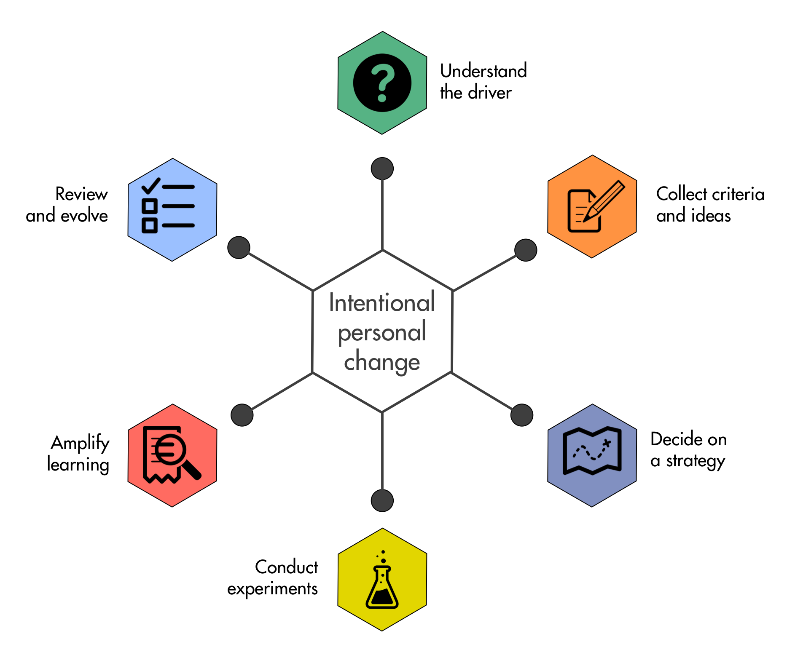
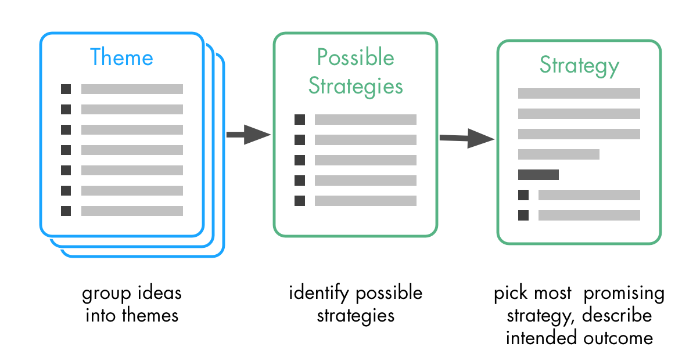
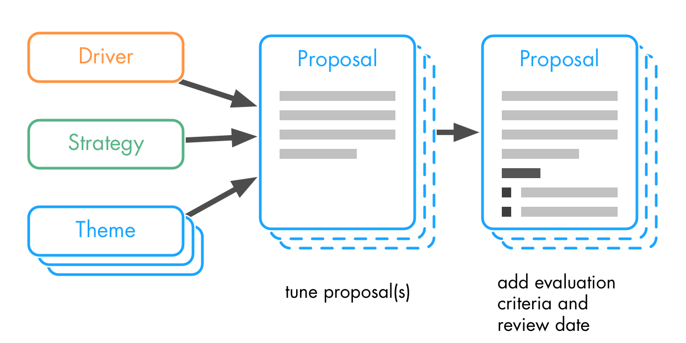
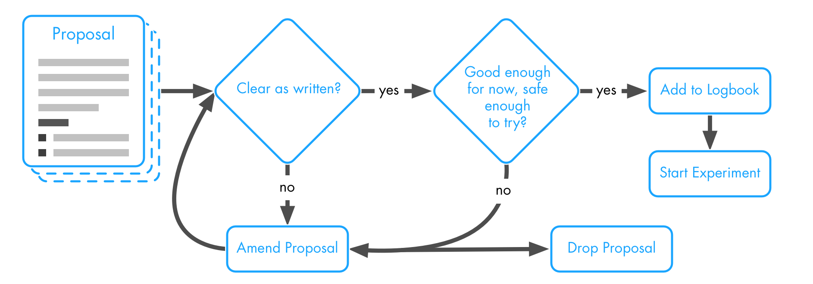
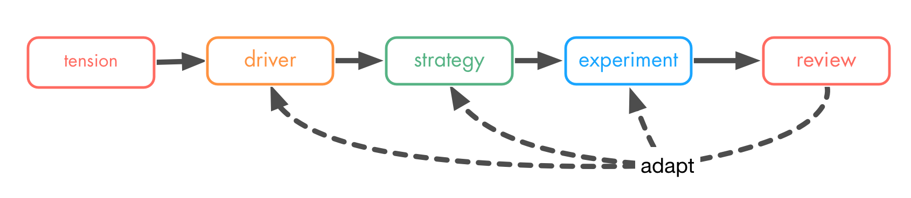
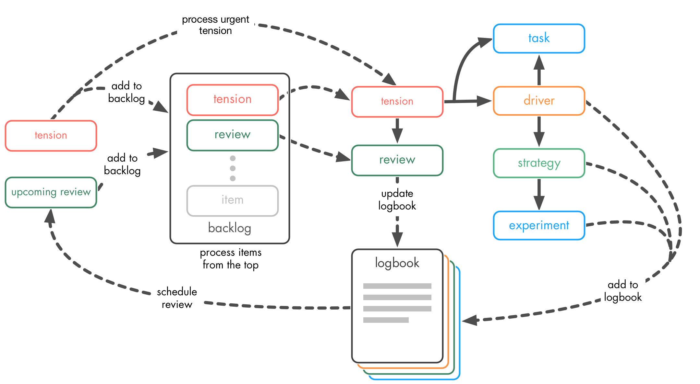

Title: S3 for One
Author: Bernhard Bockelbrink
Base Header Level: 2

# Introduction #

This guide describes the application of Sociocracy 3.0 (a.k.a. ’S3') as a framework for personal development and more mindful being. It can also serve as a method for guiding and documenting one-on-one coaching sessions.

Do you want to improve your communication skills, develop a healthier lifestyle, read more, love more, learn a new language, or get a new job? *S3 for One* provides you with a structured process to navigate intentional change in your life, be it just a small habit, a big change, a tricky decision or even the discovery of what you want to do with your life.

*S3 for One* is an adaptive process, it allows you to go as fast or as slow as you want (or can). It facilitates understanding about yourself and the situation you’re in, and helps you translate this learning into intentional and incremental change. The underlying idea is simple: you assess your situation and your needs (your "driver"), identify possible strategies and decide which one looks most promising, and then you create a series of small experiments to discover whether or not you can successfully implement your strategy. Each experiment will reveal new information about yourself, your situation, and your strategy, so you can easily adapt and evolve your approach.

The first part of this guide ("[Part 1 - Decide What To Do][]") will walk you through everything you need to do before starting with your first experiment: an assessment of your situation, identifying ideas, deciding on a strategy, defining your experiments, and committing to go. In the second part ("[Part 2 - Amplify Learning][]"), you will discover a few tools to help you with learning as much as you can from your experiments. The third part ("[Part 3 - Review and Evolve][]") will show you how to inspect and adapt your strategies and experiments, and the last part ("[Part 4 - Navigate via Tensions][]") will help you put it all together in a lightweight process.

In the [appendix][] there’s a detailed example so you can take a peek at how all of this fits together and what the results of applying *S3 for One* might look like. 

This guide is a work in progress, and a bit rough around the edges, so I’m curious for any questions, comments or suggestions you might have. You can reach me at <bernhard.bockelbrink@gmail.com>. There’s also [changelog][] so you can see what’s new.

The full text of this guide is available as a web page at <http://s3-for-one.com>, and as an ebook for download, see <http://s3-for-one.com/download.html> for details.

# Part 1 - Decide What To Do #

Many of our decisions, large or small, are made by intuition, and rationalized only after the decision was made. This is what our brains have evolved to excel in, and for many aspects of life - mostly short-term ones - this has proven to be good enough. Seen through the lens of evolution, “good enough” roughly translates to “usually doesn’t kill you before you had the chance to produce offspring”. Making decisions intuitively is statistically very efficient, especially when facing complexity combined with a lack of available information, and it prevents analysis paralysis. But often our intuition is subject to biases and fallacies (e.g. the sunk cost fallacy), and it even stands in our way when we want to change the way we make decisions or respond to certain situations.

Quite a few of our actions in daily life are not governed by decisions at all, but have been taken over by habits. Habits are a way for the brain to conserve energy, an automated and non-conscious response to a certain stimulus is less “expensive” than thinking and making a deliberate decision.

*S3 for One* brings a more conscious way of making decisions, which also is, incidentally, especially helpful for decisions about influencing your habits. Since all knowledge you have about yourself and your situation is tentative, and influencing your life is a complex matter, it’s only reasonable to acknowledge that all your decisions are tentative as well. 

That’s why it’s a good idea to consider all decisions as a series of experiments designed to help you discover your way to respond to a situation. 

Conducting an experiment is easy: you try something that you think would work, and you do it in a way you will know whether or not it has worked afterwards. That way, even when your experiment fails, you will have learned something you can use for creating new and incrementally better experiments.

Deciding on what could be the next experiment is often relatively painless, especially in a complex situation, as it only needs to be  *good enough for now, and safe enough to try*, instead of aiming for perfection. You can then use what you learned in this experiment to design the next one, and iteratively  evolve the decision until it works for you.

Making a decision, or creating an experiment happens in four main phases:

1. Picture forming: making sense of the situation and collecting ideas
2. Deciding on a strategy
3. Preparing the actual decisions or experiments
4. Committing to run the experiment (or implementing the decision)

## Picture Forming ##

In the phase of picture forming you will assess the situation and describe it in a special format, then you will reveal the scope of the issue by gathering criteria and considerations for solutions, and finally you will collect ideas you to later use as a basis for your strategies and experiments.

### The Driver ###

When we think about a project, or something we want to change in our lives, we often tend to focus mostly about outcome or goals, without considering much why we want to go there in the first place. 
So whatever it is you want to achieve, it's always a good idea to get a clear understanding what motivates you to act: what is your situation, and what are your needs. In S3, this is called the *driver*, and there’s a simple format for mapping it out: first describe the situation by listing facts and observations, then identify your needs (or requirements) that exist within the situation. 

Aim to keep it as short and to the point, but make sure it has enough details so you can return in a couple of weeks and still understand your thoughts. There’s an example how that might look like in the appendix. You might want to give your driver a name so you can easily reference it when you discuss it or think about it. You can also come up with a short phrase to sum up your driver.

While it's important to have a clear understanding of your driver, don't get lost in the details, you can usually describe a driver that's good enough to go in 5-10 minutes. Whenever you learn something new about that driver, you can simply update your description, you will even schedule periodic reviews.

### Criteria and Considerations ###

With the driver in front of you, now it's time to take a look at the scope of the issue. The goal here is to create a list that covers all relevant aspects: What are criteria for a successful solution? What do you need to find out or research? What are things you need to keep in mind? 

You will later use this list first as guide to develop ideas for solutions, and then as a “checklist” to find out whether or not  proposals for experiments (or decisions) are reasonably complete. 

To that end, it helps to write down questions instead of just bullet points. Questions inspire creativity and make it easier to be more specific: When thinking of “budget”, you could use “How much is my budget?”, and “How can I make sure to stay within budget?” to cover two distinct aspects of budgets. Instead of “action plan” you might ask “What could be a good first step?”.

Time-box yourself to 5 minutes, then pause and check whether or not your list of criteria and considerations is reasonably complete. Extend the time-box if necessary.

When you’re done, go through the list once more and mark those questions you consider essential as criteria (e.g. with a “C”), those are the ones you will need to address in the next step. The others are optional considerations.

### Collecting Ideas ###

Using the driver and your list of criteria and considerations as a guide, you begin collecting ideas as ingredients for your experiments. Treat this like a brainstorming session, go for quantity instead of quality, don't judge or evaluate your ideas, just write down as many as you can. Ideas can be just tiny steps or broad sweeps, they can build on other ideas, or contradict them, anything goes.

If your creativity runs dry, here's three simple ways to rekindle it

1. Start at the top of your list of ideas and look for ideas you can build on, expand on, or even take its opposite
2. Look at your driver and see if there's a fact, observation or need your ideas don't cover yet
3. Go through your criteria and considerations and identify those in need of more ideas

You're done if you have at least one idea to match each criterion and each need. Duration of this phase is highly dependent of the complexity of the driver and the number of criteria and considerations, but with a bit of practice you can do a lot in 10 minutes.

## Themes and Strategies ##

After you have collected enough ideas, you group them into themes so they’re easier to manage. With the themes you may be able to identify  different or even conflicting approaches, these are your potential strategies. You will pick the strategy that appears to have the highest chance of success, and define its intended outcome.

### Group Ideas Into Themes ###

When you have lots of ideas, themes will help you pick a strategy, and make it easier to integrate several ideas to form your first experiment(s).  

Go through the ideas you have collected, see which ones are similar or related and group them together - these are your themes. If you spot dependencies or conflicts, mark the ideas accordingly. Once all ideas are sorted, try and find a name for each group. Aim to keep themes clearly separated and avoid too much overlap. Depending on your scenario and the number of ideas this will probably take 10-15 minutes.

It’s not uncommon that new ideas emerge while grouping the existing ones, because the grouping activity gives you a different focus. Add as many new ideas as you see fit.

### Decide on Your Strategy ###

A **strategy** is a general approach how to respond to a driver. Think of a strategy as the outline of a plan, rather than a detailed turn-by-turn guide. 

For many drivers, there’s several possible ways how to get there, and you need to figure out which one is right for you. Following a strategy makes sense for mid- to long-term projects, the strategy provides the general direction and serves as a guideline when developing the individual experiments. A strategy should be in line with your values and your personality, so you can act with integrity. Strategies can also evolve over time, as the results of experiments indicate more effective ways to do things.

For many smaller projects, it’s over the top to create a strategy, in that case you simply continue without one and skip this part of the process. . You can always add one later if you discover you need one.

Creating a strategy has three simple steps:

1. **Identify possible strategies**: Can you identify several substantially different strategies to tackle your issue?  Consider the driver, the criteria, ideas and themes you collected, and try sketching out a few possible strategies, taking into account conflicting ideas and dependencies. Sometimes you don't see different strategies, so you simply take the obvious one
2. **Pick a strategy**: Take a look at the possible strategies and select the one which appears to be most promising to you. There's no need for deep analysis here, you will have the chance to inspect and adapt this decision later in the process.
3. **Describe Intended Outcome**: What is the intended outcome of your strategy? A good description of an intended outcome is a list of simple and measurable (or falsifiable) statements. Look to your criteria and considerations, each of those will hint at one or even several statements, but not all might be relevant to your strategy.

## Shaping Proposals ##

You're clear about your situation and motivation, have collected criteria and ideas, and maybe even have defined your strategy, so everything's set for creating your first experiment. 

### Tuning Proposal(s) ###

The ideas you collected are most likely too many to implement all at once, and usually don't form a consistent whole, you will find contradictory ingredients and some gaps in need of bridging.

It's a good idea to create an ordered backlog of the ideas (if you have defined a strategy, you would limit yourself to those ideas relevant to that strategy), using these questions as guides:

* What is the most important aspect for me to address?
* What carries the highest personal risk for me?
* Where's the highest uncertainty?
* What are dependencies?
* What do I need to learn/research?

### Defining Evaluation Criteria and Review Date(s) ###

How do you know whether or not your experiment was a success? How can you determine when it's time to stop and try something else? 

You need to be clear about your assumptions and expectations, what do you expect to change through running the experiment. Are your expectations SMART? (Specific - Measurable - Attainable - Realistic - Timed)

Again, look at your driver (facts, observations and needs) as well as your criteria and considerations as a guide for defining simple metrics and be specific what range of measurements you would consider the experiment a success.

  The key concept here is falsification: what would you accept as evidence that your assumptions have been wrong? Its imperative to think about this before you start the experiment, because after the start all kinds of cognitive biases may kick in (e.g. sunk cost fallacy), preventing you from making a rational decision. 

More evaluation criteria, complex metrics, and more data points can jeopardize experiments. If something is hard to measure, chances are you won't consistently sustain the effort of measuring, which will reduce or even eliminate your return on investment of running the experiment.

So if you discover you need a lot of evaluation criteria to measure successful outcome, and you shiver when thinking about taking all those measurements, it's probably a good idea to return to the tuning phase and reduce complexity of the experiment. 

Time box yourself to 10 minutes, at first, defining good evaluation criteria may seem hard, but after a few experiments you will have picked up that skill. 

The last step is scheduling the first review: when will you evaluate outcome and make a decision whether to stop, continue or evolve the experiment? With most experiments, you might want to do this after one month, even earlier when you believe there's a high risk of failure. You will set the date for the following review in the review.

## Commit to Go ##

Before you start, you should take one last good look at each of your proposals and determine if it's good to go.

### Clear as written ###

Is the proposal documented in a way you will understand it a few months down the road? Now's the time to make amendments, because memory is a tricky thing and guessing and misunderstandings down the road often invalidates the learning from your experiments (and sometimes even without you noticing, which is the worst kind of waste).

### Good Enough for Now, Safe Enough to Try ###

A proposal does not need to be perfect, you will tune and evolve it as you go. Still it has to be good enough for now, and safe enough to try, with no obvious flaws. Here's some questions to evaluate your proposals with:

* Do I think I can pull this off, or am I trying something that does not match my skills and my personality?
* Will this make a difference for me, is this the best use of my time?
* Is there some resistance within me?
* Can I start right away, or is there something missing or unclear?
* Is there a risk I'm uncomfortable with?
* Can I simplify this proposal?

If the proposal passes this test, and if you don't find any other objection against going forward with this experiment, put the review date in your calendar and commit yourself to start. 

Congratulations, this is a time to celebrate. Then you can begin to put your plan into action.

# Part 2 - Amplify Learning #

Tbd.

## The Logbook ##

You need to develop and maintain a logbook for tracking all relevant information, otherwise you will not be able to reap the full benefit of a structured approach. 

To make this work for you, you might need to develop your system which makes it easy to document progress/metrics and experiences. Your system you should be simple, fast, flexible, portable and pleasant to use. Whatever works for you is great. If your prefer a digital solution, you might want to take a look at [Simplenote](https://simplenote.com) (web, Windows, Mac, Linux, iOS, Android, Kindle Fire), [Evernote](http://evernote.com) (web, Windows, Mac, Android, iOS), [Trello](http://trello.com) (web, iOS, Android), [Google Docs](http://docs.google.com) and [Google Sheets](http://sheets.google.com) (web, iOS, Android), and [Day One](http://dayoneapp.com) (Mac, iOS)

I find that Outliners (e.g. [OmniOutliner](https://www.omnigroup.com/omnioutliner/), [Carbon Fin Outliner](http://www.carbonfin.com/), [WorkFlowy](https://workflowy.com/)) or digital whiteboards are helpful for picture forming and defining and evolving your experiments, as they allow for quickly re-arranging and grouping things, especially on touch screens.

## Taking Notes ##

To make sure you make as much as possible from your experiments, it's not enough to just document your drivers, strategies and experiments, you most likely also need to take notes as you go.

There's three levels of logging, the more you log, the more you'll learn:

* the metrics you committed to
* experiences and thoughts you had when conducting the experiment 
* a personal diary of thoughts, experiences etc. which are seemingly unrelated to your experiments, but may offer valuable insights later

As you are conducting experiments which will often affect your general wellbeing or emotional state, a personal diary is helpful to see correlations between experiments and the "rest of your life", you will often have valuable insights and ideas as you write your diary.

## Personal Retrospectives ##

A personal retrospective is a session where you reflect on either a certain period of time or a finished project or experiment in order to identify patterns and discover growing edges as well as possible improvements. A retrospective usually has 5 phases:

1. **setting the stage**: review your notes from the last retrospective on what you wanted to improve [^if you have any notes], tune in to the subject of the retrospective, get in the mood for reflection
2. **gather data**: review your logbook or diary, maybe sketch out a timeline with the most important events to jog your memory
3. **generate insights**: make a list of the patterns, anomalies and tensions you recognized when gathering data
4. **decide what to do**: pick the top three items from your list and decide what to do about each of them. Sometimes the result will be a task or an action you can do right on the spot, sometimes you will schedule it for later, and sometimes you will simply update a driver, strategy or experiment. Take a look at the rest of your list, maybe there’s one or two things you want to add to your *tension backlog* (explained in more detail in Part 4 - Navigate via Tensions). There’s no need to keep everything, the important stuff will inevitably come back.
5. **close the retrospective**: Do a quick review of the retrospective, what did you achieve in this retrospective, what can you improve next time?

For each of the phases, there are many different ideas and formats, which will probably be discussed in a later version of this guide.

A weekly retrospective might just take 10-15 minutes, if you reflect on a project or experiment, it will take a bit longer, but rarely more than 30 minutes.

**Tools for retrospectives**: The possibilities are endless, you can do a retrospective on a piece of paper, in a notebook, on a whiteboard, on a wall or desk using sticky notes, on a tablet (using a note taking app, or even a drawing app) or with a computer (using any word processor, outliner, text editor).

**Documenting the retrospective**: The relevant output of a retrospectives is the actions you planned and your notes about what to improve in the next retrospective. Some people prefer to record the whole retrospective in their [logbook][], however that is entirely optional.

# Part 3 - Review and Evolve #

On a regular basis you will spent a few minutes with each of your drivers, strategies and experiments so that you can continuously evolve and adapt them as you learn. After each review, make sure to schedule the next one. For new experiments, you should aim for a short cadence, like a couple of weeks, but after a few iterations it’s ok to do a review only once or twice a year.

## Triggering an Early Review ##

Whenever you discover a significant tension with a driver or one of your experiments, you can trigger an early review, as waiting for the scheduled review is probably a waste of time. Make a note in the logbook of the reasons for reviewing early for future reference.

## Reviewing Experiments ##

For the regular review of an experiment, you need your logbook and about 10 minutes of quiet time. 

Review the experiment and your notes, and then answer these questions:

* Is the experiment on track?
* Did I learn anything I could use to update the experiment?
* Did I do all l committed to doing? If not: why not? What can I learn about myself to update the experiment to increase my chances of success. Are there implications for the strategy or the driver?
* Is the experiment still of value to me, or does it make more sense to stop it and invest my time in something else?

When reviewing an experiment, you might learn something about your strategy or your driver, so sometimes it makes sense to schedule an early review of strategy, driver, or both.

## Review Strategy and Intended Outcome ##

A strategy should change with what you learn about yourself and your environment as you conduct experiments. Some strategies (as well as the intended outcomes) just need to be tweaked a little now and then, with other strategies you eventually discover that you better drop them and develop a new one. 

Here’s a few useful questions to help you review strategies quickly:

* Is the strategy still viable, can I still create new experiments that bring me closer to the intended outcome?
* Is the description of the strategy still good enough?
* Is the intended outcome in line with the strategy?
* Can I  describe the intended outcome more clearly?

When you update a strategy, you need to check if this also affects experiments derived from the strategy. 

Once you decide you need to drop a strategy because it’s no longer helpful, you simply do a quick review of the driver and then update your notes from the previous picture forming session in order to identify a new strategy. From the new strategy you can develop new experiments.

## Review the Driver ##

Drivers change over time, the situation evolves, which, in turn, might affect the needs. Reviewing a driver is simple, and often takes just a few minutes:

1. Go through the list of facts and observations, and with each of them ask yourself: is this statement still correct and relevant to the driver? Can I update it so it's more the point, did I learn something about it I need to capture here?
2. Are there new facts or observations relevant to the driver I need to add?
3. Go through each need: is this still an accurate description of this need? Is this need still present, and relevant to the driver?
4. Are there new needs you discovered in this domain?

After making significant updates to a driver, it’s a good idea to scan associated strategies and experiments, as they also might need an update, or at least leave a note for their next review.

Sometimes a driver ceases to exists, either because your strategies and experiments were successful, or because the situation has changed substantially despite your best efforts. Either way, it would not make sense to invest more energy, so you archive that driver and the associated documents in your logbook.

# Part 4 - Navigate via Tensions #

Tbd.

## Collecting and Processing Tensions ##

Whenever you discover something which is not the way it should be, you have three choices

* ignore it (great for unimportant stuff)
* do something about it right now (great for small stuff, if you can spare the time, but this might deter you from your actual plans)
* schedule it for later, e.g. to pick it up in your monthly navigation session

## The Monthly Navigation Session ##

The monthly session is an appointment with yourself where you process your backlog of tensions (including scheduled reviews). 

It is good practice to time-box the session, depending on your situation you can expect the session to take between 30 and 90 minutes.

The session usually consists of five phases:

1. **Tune in**: Take a brief look at our suggestions for improvements from the last session.
2. **Review backlog and decide on agenda**: time-box this phase to 5 minutes, and take a look at you tension backlog to compile an agenda of the things you want to process in this session. Put the most important item on top, and do a quick estimate for each item how much time you’ll need to deal with it.
3. **Process your agenda**:  Work through the items on your agenda in order of importance, and set the time box for each item to your estimate from phase one. If an item can't be completed in the session, you can schedule a separate session for a later date (but before the next navigation session). Often it’s a good idea to look at the driver, and then make that decision. 
4. **Update tension backlog**: Make sure you remove processed items the tension backlog, and update priorities of the remaining items accordingly. If this takes longer than a few minutes, you may use the wrong system to maintain your backlog, or it may contain too many unimportant items.
5. **Short review of the session**: What went well, what can you improve next time?

## The Tension Backlog ##

tbd.

# Some Consideration for Successful Implementation #

It’s perfectly ok to start small, sometimes all it takes is understanding a driver, and your actions will naturally flow to align with it. In many cases you can skip strategies and intended outcome. For simple drivers and experiments there’s sometimes little value in retrospectives or reviews.

So if some ideas in *S3 for One* look like you don’t need them, or they’re not working for you, don’t use them. However, if you find you’re stuck, or you sense that you’re ready for taking things to the next level, I suggest you give those ideas a try: make it an experiment and see what happens. 

I wish you the best of luck, email me for any questions or comments at <bernhard.bockelbrink@gmail.com>.

# Appendix #

## Changelog ##

**May 2016**: Revised section about strategy.

**April 2016**: Revised the guide, created website and ebook versions

**January 2016**: added section “navigation via tension”, and the example in the appendix.

**December 2015**: added illustrations and introduction, expanded sections 1-3

**October 2015**: First draft of the guide for use in personal coaching.

## About the Author ##

As a coach, trainer and consultant I support individuals, teams and organizations in navigating complex challenges and developing a culture of effective, conscious and joyful collaboration.

To that end, I bring in all my experience with change management, collaboration, organizational development, leadership, agile and lean, software development, product management, personal and organizational coaching, facilitation and Sociocracy 3.0.

Together with my friend James Priest I am a steward of Sociocracy 3.0 (S3), and I dedicate some of my time to developing and spreading knowledge about S3. 

If you’re curious, you can learn more about what I do at my website <http://evolvingcollaboration.com/about-me/>.

Bernhard Bockelbrink, April 2016

## Resources ##

The full text of this guide is available as a web page at <http://s3-for-one.com>, and as an ebook for download, see <http://s3-for-one.com/downloads.html> for details.

*S3 for One* builds on Sociocracy 3.0 (a.k.a. S3), a framework I created together with my friend James Priest. S3 contains more than 60 patterns for for collaboration in agile organizations.  You can find out more about Sociocracy 3.0 at <http://sociocracy30.org/>.

## Simple Template for Documenting a Decisions and Experiments ##

Tbd.

## An Example ##

As an example to demonstrate what the application of *S3 for One* might look like, here’s the output of a session of  of picture forming and proposal shaping. It illustrates how much detail can be created, and shows both a strategy with the corresponding proposal, and a simple proposal that does not require a strategy.

### Driver - Improving My Job Situation ###

* I have been employed in a small organization for around 4 years now
* I'm happy with the work and with my colleagues
* In my current job, there's no money to invest in training, and no policies for developing skills
* Sometimes I'm a bit bored with my job, I've done it all before
* I don't know how my skills compare to others, and I don't know what my value on the market is
* I have no idea what my colleagues earn[^ where I live it's legal to talk about salary even if there's a clause in the contract which states salary is confidential], and I don't know about the financial situation of the organization
* I don't think I am paid enough for my contribution to the organization, e.g. I developed a product for one customer, which has now been sold to several other customers, creating substantial additional revenue for the organization 
* I have two kids, who live with me every other week.
* My job gives me enough time and flexibility to spend time with my kids
* I started as a software developer, but now I'm a project manager
* Before I started this job, I had 5 years of experience as a tech consultant for a big insurance company, then I took a sabbatical
* I rent a flat close to the schools of my kids, which is a bit too big for my needs
* My current salary is not enough to sustain me and my kids, I have not been able to save money in the past 4 years, instead I sometimes need to take money out of my savings
* I don't have a detailed overview over my financial situation

#### Needs ####

* I want a long-term job
* I want to work in an culture of trust, and with colleagues I can build relationships with
* I need to earn enough money to sustain myself and my kids
* I need to refill my savings so that I have money for helping my kids through university, and for my own retirement
* I need appreciation for my contribution, not only in terms of compensation.
* I need a fair compensation for my work
* I need a bit of flexibility to spend enough time with my kids when they are with me, and work more when they're not.
* I have a need for developing my skills my learning new things
* I sometimes have a need for greater challenges

### Picture Forming ###

#### Criteria and Considerations ####

* Can I describe how flexible I need to be so a potential future employer can easily see if that is possible?
* How can I find out whether or not my current employer can and would give me a raise?
* How can I find potential new employer?
* How much money do I need?
* How can I get an overview over my financial situation, what I spend each month, and for what (even if there's some resistance within me to against finding out)
* How can I find out what my skill levels are so that I can present myself adequately to my present and potential future employers?
* Would it help to know what my colleagues earn? How can I find that out so that I know my compensation is fair?
* How can I find out my current "market value"
* How can I find out what makes a good recruiter? 
* How can I look for a new job that would need all my needs?
* Is there something I can change so that I spend less money?
* How can I develop my skills in my current situation?
* Is there a way to have more of a challenge in my current job?

#### Ideas ####

* Ask my employer what my colleagues earn
* I could figure out what I want to save each year, and add this amount plus what I took out of my savings each year to calculate the pay rise I need.
* I could up the stakes by telling my employer I'm looking for a new job because I need more money
* I could ask my friends if they know potential employers or recruiters.
* Talk to my employer if I can take some time every other week to learn new stuff.
* I could look for a good recruiter to work with and assess my skills and my market value, and then have them suggest potential employers.
* Search for websites and publications about compensation in my sector
* I can try and gather as much information as I can about company finance and compensation of my colleagues, and use that information to negotiate a raise with my employer.
* I could talk to my employer and be open about what I need.
* I could negotiate a pay rise
* I could look for a new job.
* I could look at my bank transactions of the last year and see where my money goes and where I could spend less.
* I can update my CV and see if I can get one or two job interviews to find out how much I am worth to another organization.
* I could research skill levels and common ways of skill assessments in my sector.
* I could (secretly) spend a few hours every week learning new things during work hours.
* Ask my colleagues what they earn
* I could draft a week plan to see how much I can work when my kids are with me and when they are not.
* I can find out what my market value is and how much money I need, and discuss that openly with my employer.
* I could make a detailed list for what I'm looking for in a new job.

#### Potential Strategies ####

* Try to get as much information as I can and use that to my advantage when negotiating a raise with my current employer. 
* Get enough information so I can approach my employer and propose an honest and open exchange about my needs and possibilities to fulfill them. If that fails, start looking for a new job.
* Start looking for a new job and take the first offer that meets my needs.
* Tell my current employer I'm looking for a new job to negotiate a pay rise.
* Start looking for a new job without telling my employer, and then decide whether to take a new job or use an offer from another employer to negotiate a better deal with my current employer.

### Strategy: Gather Just Enough Information for Honest Exchange ###

My strategy is this: I will gather enough information so I can approach my employer and propose an honest and open exchange about my needs and discuss possibilities to fulfill them. If that fails, I'll start looking for a new job. 

#### Intended Outcome ####

In the best case we will have an open conversation and reach an agreement about a pay rise that works for both of us. This will also be helpful for our future work relationship.

In the worst case, I will either find out that a pay rise is not possible in this organization, or even that my employer is not interested in an open conversation about compensation. In both these cases I will have learned that it does not make any sense for me to stay with this organization, so I will need to look for a new job.

#### Proposal ####

##### Prepare the conversation #####

I will figure out what I want to save each year, and add this amount
 plus what I took out of my savings each year to calculate the pay rise
 I need.

Then will find out if that is a realistic number:

* I will search for websites and publications about compensation in my sector
* I will try asking my colleagues what they earn
* I will ask a few friends if they can recommend a recruiter who could give me a quick estimate of my market value 

Also I will make a list of reasons why this pay rise is reasonable

* skills I have that benefit the organization 
* what I learned since joining the organization 
* my estimate how much money I already made for the organization
* ...

##### Schedule the Conversation #####

When my preparations are done (at most 2 weeks from today), I will ask my employer to schedule a conversation about my compensation where I can present why I think it's reasonable for me to earn more money, and we work collaborate on an agreement that works for both of us.

##### During the Conversation #####

I will present what I prepared and then listen to what my employer has to say. I will take notes so that I can remember the main points. After hearing my employer's response, if it makes sense I will invite them to start collecting ideas and then co-create a proposal for my compensation.

I will not take or reject any offer in this session, instead I will propose to think about it for at least a day.

##### Evaluation/Review #####

I will block time in my calendar right after the conversation so I have time for a review. I will go out and have a coffee to avoid interruptions. Main points for review are:

* achievements
* openness / integrity
* willingness to collaborate

After addressing these points I will have a good idea whether or not I want to stay with the organization.

### Other  Proposal(s) ###

This proposal is also covered by the driver, but unrelated to the previous strategy, so it can be implemented in parallel.

#### Learning new things ####

I will take a few hours each week to learn new things. To that end, I will schedule study periods every Tuesday morning for 90 minutes, and Thursday right after lunch for 60 minutes. In my first session I will compile a short backlog topics relevant to my current projects.

**Concerns**: suggested study periods might not be practical, I need to inspect this experiment soon so I can react. 

I will log learning session start and end times, as well as the topics. I will also log whenever I notice that I have applied what I have learned.

I will review this experiment one month from now. 
